# Swarm Robotics Toolbox (SR Toolbox)

El *Swarm Robotics Toolbox* consiste de un script "maestro" que agrupa múltiples funcionalidades en un solo programa. Esto significa que el usuario no debe abrir 20 scripts diferentes para cada prueba a realizar. Todo está contenido en el mismo livescript, acelerando significativamente el tiempo de realización de pruebas.

Además, para facilitar la comprensión del código, casi todas las líneas de código están comentadas y las funciones creadas poseen documentación propia (escribir en la ventana de comandos `help nombreFuncion`).

Cabe mencionar que el script "maestro" (`SR_Toolbox.mlx`) puede ser fácilmente modificado para acomodar nuevas funcionalidades. Debido a esto, scripts como `Pruebas_PSOTuner.mlx`, se pueden considerar copias modificadas de `SR_Toolbox.mlx`. Por lo tanto, a continuación únicamente se explica la estructura y funciones del *SR Toolbox*, ya que con comprender las mismas, es posible entender casi el 80% de todos los demás scripts asociados. Para los mismos se presentan secciones mucho más cortas que explican las características particulares que difieren con respecto al *SR Toolbox*.

## Índice

1. [Estructura de Programa](#estructura-de-programa)
    - [Limpieza de Workspace](#limpieza-de-workspace)
    - [Parámetros y Settings](#parámetros-y-settings)
    - [Reglas de Método a Usar](#reglas-de-método-a-usar)
    - [Región de Partida y Obstáculos de Mesa](#región-de-partida-y-obstáculos-de-mesa)
2. [Funciones](#funciones)
3. [Análisis de Resultados](#analisis-de-resultados)
     - [Evolución del Global Best](#evolución-del-global-best)
     - [Análisis de Dispersión de Partículas](#análisis-de-dispersión-de-partículas)
     - [Velocidad de Motores](#velocidad-de-motores)
     - [Suavidad de Velocidades](#suavidad-de-velocidades)
   - [Grabación de Videos / Frames](#grabación-de-videos--frames)
6. [Demostración](#demostración)
   - [Partículas Esquivando Obstáculo](#partículas-esquivando-obstáculo)
   - [Polígono Personalizado](#polígono-personalizado)


## Estructura de Programa

A continuación se describen todas las secciones que conforman al script `SR_Toolbox.mlx`. Se explican las diferentes características y elementos que pueden llegar a ser cambiados.

### Limpieza de Workspace

<p align="center">
   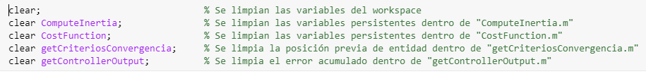
</p>

Esta sección se encarga de limpiar todas las variables del *Workspace* en caso existieran variables pre-existentes propias de otros scripts o de ejecuciones previas del *Toolbox*. También se limpian las **variables persistentes** empleadas dentro de diferentes funciones del *Toolbox*.

<details>
<summary> <sub><strong>Variables Persistentes</strong> (Hacer click para más información)</sub> </summary>
<sub> En Matlab, los valores de las variables dentro de una función desaparecen luego de que la misma finaliza su ejecución. Para poder mantener el valor de una variable entre diferentes llamadas a la función, se declara a la variable como <tt>persistent</tt>. La desventaja de declarar variables de este tipo, es que su valor se restablece hasta que el usuario reinicia Matlab. Para limpiar estas variables de forma programática, se debe escribir <tt>clear</tt> seguido del nombre de la función que contiene variables persistentes.
</sub> </details> <br/>

### Parámetros y Settings

<p align="center">
   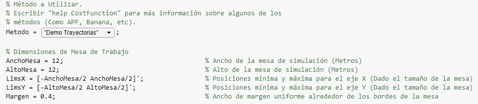
</p>

Esta sección permite controlar una gran variedad de elementos propios de la simulación, desde parámetros dimensionales y visuales, hasta la *seed* a utilizar. A continuación se presenta una breve explicación de cada uno de los parámetros que pueden llegar a ser cambiados. **Hacer click en el nombre de cada parámetro para desplegar más información**.

<ins>*Método a Utilizar*</ins>

<details>
<summary> <tt>Metodo</tt> </summary>
<sub>Tipo de método a simular. El usuario puede elegir tres tipos de método: Métodos dependientes de PSO, métodos basados en el seguimiento de una trayectoria y métodos dinámicos (no requieren de planeación previa para explorar). En el caso de los métodos PSO, el método elegido pasa a llamarse función de costo. Existen 17 métodos disponibles: </sub>

<p><ul><li><sub>
Dropwave: Dependiente de PSO. Se minimiza la función de costo "Benchmark" observada. Coords. mínimo: (0,0). Dimensiones: 2. Obtenida de la <a href="https://www.sfu.ca/~ssurjano/drop.html">Virtual Library of Simulation Experiments</a>.
</sub></li></ul></p>

<p align="center">
   
</p>

<p><ul><li><sub>
Rosenbrock / Banana: Dependiente de PSO. Se minimiza la función de costo "Benchmark" observada. Coords. mínimo: (1,...,1). Dimensiones: d. Obtenido de la <a href="https://www.sfu.ca/~ssurjano/rosen.html">Virtual Library of Simulation Experiments</a>.
</sub></li></ul></p>

<p align="center">
   
</p>

<p><ul><li><sub>
Levy / Levy N13: Dependiente de PSO. Se minimiza la función de costo "Benchmark" observada. Coords. mínimo: (1,1). Dimensiones: 2. Obtenida de la <a href="https://www.sfu.ca/~ssurjano/levy13.html">Virtual Library of Simulation Experiments</a>. Existe una función de costo que se llama solo "Levy", pero en este caso se utiliza el término Levy como una abreviación a Levy N13.
</sub></li></ul></p>

<p align="center">
   
</p>

<p><ul><li><sub>
Himmelblau: Dependiente de PSO. Se minimiza la función de costo "Benchmark" observada. Coords. mínimo: (3,2), (-2.8051 3.1313), (-3.7793 -3.2831) y (3.5844 -1.8481). Dimensiones: 2. Obtenida de <a href="https://en.wikipedia.org/wiki/Himmelblau%27s_function">Wikipedia</a>.
</sub></li></ul></p>

<p align="center">
   
</p>

<p><ul><li><sub>
Rastrigin: Dependiente de PSO. Se minimiza la función de costo "Benchmark" observada. Coords. mínimo: (0,...,0). Dimensiones: d. Obtenida de la <a href="https://www.sfu.ca/~ssurjano/rastr.html">Virtual Library of Simulation Experiments</a>.
</sub></li></ul></p>

<p align="center">
   
</p>

<p><ul><li><sub>
Schaffer F6 / Schaffer N2: Dependiente de PSO. Se minimiza la función de costo "Benchmark" observada. Coords. mínimo: (0,0). Dimensiones: 2. Obtenida de la <a href="https://www.sfu.ca/~ssurjano/schaffer2.html">Virtual Library of Simulation Experiments</a>.
</sub></li></ul></p>

<p align="center">
   
</p>

<p><ul><li><sub>
Sphere / Paraboloid: Dependiente de PSO. Se minimiza la función de costo "Benchmark" observada. Coords. mínimo: (0,...,0). Dimensiones: d. Obtenida de la <a href="https://www.sfu.ca/~ssurjano/spheref.html">Virtual Library of Simulation Experiments</a>.
</sub></li></ul></p>

<p align="center">
   
</p>

<p><ul><li><sub>
Booth: Dependiente de PSO. Se minimiza la función de costo "Benchmark" observada. Coords. mínimo: (1,3). Dimensiones: 2. Obtenida de la <a href="https://www.sfu.ca/~ssurjano/booth.html">Virtual Library of Simulation Experiments</a>.
</sub></li></ul></p>

<p align="center">
   
</p>

<p><ul><li><sub>
Ackley: Dependiente de PSO. Se minimiza la función de costo "Benchmark" observada. Coords. mínimo: (0,...,0). Dimensiones: d. Obtenida de la <a href="https://www.sfu.ca/~ssurjano/ackley.html">Virtual Library of Simulation Experiments</a>.
</sub></li></ul></p>

<p align="center">
   
</p>

<p><ul><li><sub>
Griewank: Dependiente de PSO. Se minimiza la función de costo "Benchmark" observada. Coords. mínimo: (0,...,0). Dimensiones: d. Obtenida de la <a href="https://www.sfu.ca/~ssurjano/griewank.html">Virtual Library of Simulation Experiments</a>.
</sub></li></ul></p>

<p align="center">
   
</p>

<p><ul><li><sub>
Six-Hump Camel: Dependiente de PSO. Se minimiza la función de costo "Benchmark" observada. Coords. mínimo: (0.0898,-0.7126) y (-0.0898,0.7126). Dimensiones: 2. Obtenida de la <a href="https://www.sfu.ca/~ssurjano/camel6.html">Virtual Library of Simulation Experiments</a>.
</sub></li></ul></p>

<p align="center">
   
</p>

<p><ul><li><sub>
Styblinski-Tang: Dependiente de PSO. Se minimiza la función de costo "Benchmark" observada. Coords. mínimo: (-2.903534,...,-2.903534). Dimensiones: d. Obtenida de la <a href="https://www.sfu.ca/~ssurjano/stybtang.html">Virtual Library of Simulation Experiments</a>.
</sub></li></ul></p>

<p align="center">
   
</p>

<p><ul><li><sub>
Easom: Dependiente de PSO. Se minimiza la función de costo "Benchmark" observada. Coords. mínimo: (pi,pi). Dimensiones: 2. Obtenida de la <a href="https://www.sfu.ca/~ssurjano/easom.html">Virtual Library of Simulation Experiments</a>.
</sub></li></ul></p>

<p align="center">
   
</p>

<p><ul><li><sub>
Michalewicz: Dependiente de PSO. Se minimiza la función de costo "Benchmark" observada. Coords. mínimo: (2.2,1.57) si d = 2. Obtenida de la <a href="https://www.sfu.ca/~ssurjano/michal.html">Virtual Library of Simulation Experiments</a>. Esta función soporta "d" dimensiones, pero solo se implementaron 2 ya que se desconocen las coordenadas de los mínimos en dimensiones superiores (además que me dio haraganería).
</sub></li></ul></p>

<p align="center">
   
</p>

<p><ul><li><sub>
Jabandzic: Dependiente de PSO (con elementos de seguimiento de trayectorias). Un robot se mueve desde la región de partida a la meta intentando esquivar obstáculos a lo largo del camino. El robot utiliza LiDARs (sensores ultrasónicos glorificados) para modelar su ambiente y crear una función de costo cuyo mínimo se encuentra en el siguiente punto óptimo al que debería de moverse. Para encontrar las coordenadas de este mínimo se utiliza el algoritmo PSO. Una vez se tienen dichas coordenadas, se mueve al robot ahí. Si el robot alcanza esta meta, se "refresca" la función de costo y se genera una nueva meta óptima. Basado en <a href="https://www.researchgate.net/publication/310456939_Particle_swarm_optimization-based_method_for_navigation_of_mobile_robot_in_unstructured_static_and_time-varying_environments">este paper</a>.
</sub></li></ul></p>

<p align="center">
   
</p>

<p><ul><li><sub>
Dynamic Programming: Seguimiento de trayectorias. Método basado en el ejemplo de reinforcement learning <a href="https://cs.stanford.edu/people/karpathy/reinforcejs/gridworld_dp.html">GridWorld</a>. En este, la mesa de trabajo se cuadricula. El script escanea cada una de las celdas y determina si la celda contiene un obstáculo o meta. Luego, se coloca a un agente en la mesa cuadriculada y se le permite moverse en 8 direcciones: Arriba, abajo, izquierda, derecha, arriba-derecha, arriba-izquierda, abajo-izquierda y abajo-derecha. El agente se mueve sobre la cuadrícula siguiendo algunas reglas: Si trata de moverse hacia una celda con un obstáculo este se regresa a la celda que ocupaba antes, si se choca contra una pared recibe un pequeño castigo y si llega a la meta recibe una recompensa muy grande. Utilizando los castigos y recompensas como guía, el agente aprende que acciones debe tomar en cada celda para obtener la mayor recompensa. Estas acciones son luego seguidas por los robots diferenciales, creando una trayectoria que los mismos pueden seguir hasta la meta.
</sub></li></ul></p>

<p align="center">
   
</p>

<p><ul><li><sub>
Demo Trayectorias: Seguimiento de trayectorias. Método que busca demostrar las capacidades de seguimiento de trayectorias de la Swarm Robotics Toolbox. Tiene dos modos: Meta única y multi-meta. En meta única, un número de E-Pucks especificado por el usuario sigue una trayectoria compuesta por 3 metas consecutivas. En multi-meta, se utilizan 3 E-Pucks y cada uno sigue una trayectoria diferente compuesta por 3 metas consecutivas. Se puede especificar si se desea que las trayectorias sean cíclicas o no cíclicas. Si son cíclicas, una vez alguno de los E-Pucks llega a la última meta en su trayectoria, se retorna al primer punto y se repite la trayectoria.
</sub></li></ul></p>

<p align="center">
   
   
</p>

</details><br/>

<ins>*Dimensiones de Mesa de Trabajo*</ins>

<details>
<summary> <tt>AnchoMesa</tt> </summary>
<sub>Ancho de la mesa de trabajo. Unidades en metros.</sub>
<p align="center">
   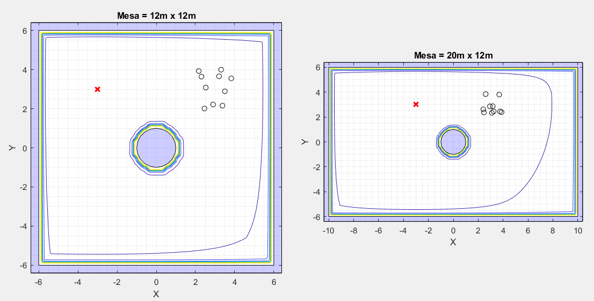
</p>
</details>

<details>
<summary> <tt>AltoMesa</tt> </summary>
<sub>Alto de la mesa de trabajo. Unidades en metros.</sub>
<p align="center">
   
</p>
</details>

<details>
<summary> <tt>Margen</tt> </summary>
<sub>Ancho del margen uniforme que existirá alrededor de los bordes de la mesa de trabajo. Unidades en metros.</sub>
<p align="center">
   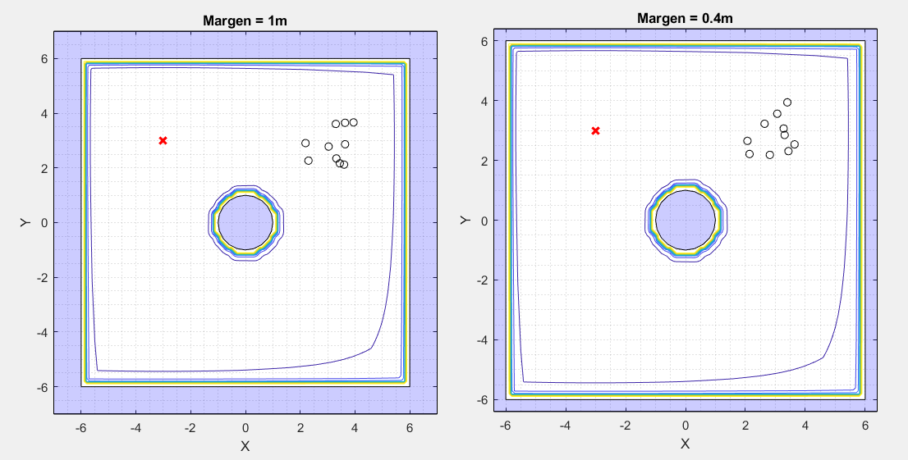
</p>
</details><br/>

<ins>*Settings de Simulación*</ins>

<details>
<summary> <tt>EndTime</tt> </summary>
<sub>Duración total de la simulación en segundos.</sub>
</details>

<details>
<summary> <tt>dt</tt> </summary>
<sub>Delta de tiempo, tiempo de muestreo o cantidad de segundos que transcurrirán entre cada una de las iteraciones del main loop del algoritmo.</sub>
</details><br/>

<ins>*Settings de Partículas PSO*</ins>

<details>
<summary> <tt>NoParticulas</tt> </summary>
<sub>Cantidad de partículas a utilizar dentro del algoritmo de PSO. En los métodos dependientes de PSO, el número de partículas tiende a sobre-escribir el número de E-Pucks a utilizar también.</sub>
</details>

<details>
<summary> <tt>PartPosDims</tt> </summary>
<sub>Cantidad de dimensiones que tendrán las posiciones de las partículas PSO. El objeto <tt>PSO.m</tt> tiene la capacidad de manejar tantas dimensiones como se le soliciten, no obstante, se recomienda mantener su valor en 2 dimensiones para no interferir con el funcionamiento de la mayor parte de métodos.</sub>
</details>

<details>
<summary> <tt>IteracionesMaxPSO</tt> </summary>
<sub>Número de iteraciones máximas a utilizar por el algoritmo PSO. Este parámetro existe porque no en todos los métodos se desea que el tiempo de simulación coincida con el tiempo que le toma al PSO correr por completo.</sub>
</details>

<details>
<summary> <tt>CriterioPart</tt> </summary>
<sub> Criterio de convergencia que utilizará el algoritmo PSO para evaluar el momento en el que debe dar fin al algoritmo. Se ofrecen tres opciones: Meta Alcanzada, Entidades Detenidas e Iteraciones Max. Para más información escribir <tt>help getCriteriosConvergencia</tt>.</sub>
<p align="center">
   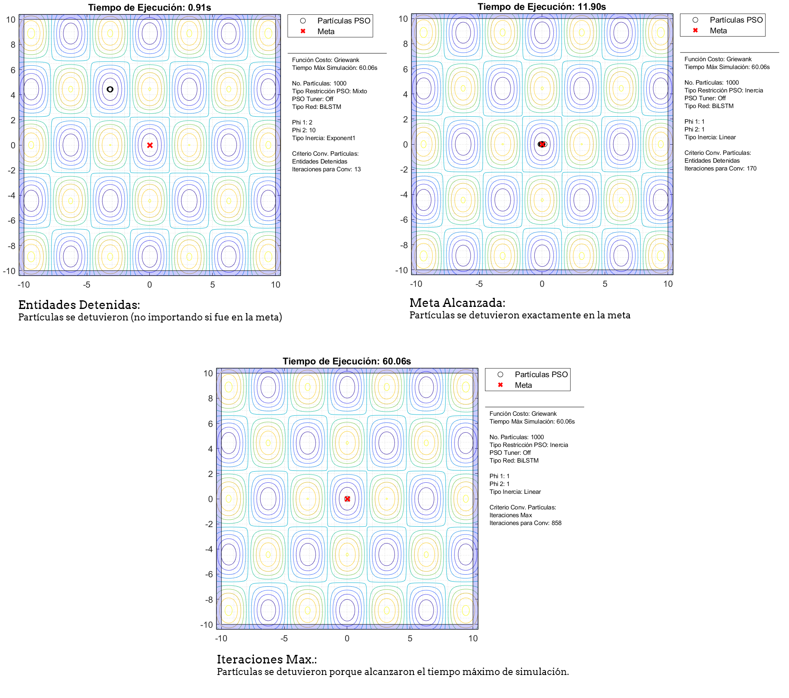
</p>
</details>

<details>
<summary> <tt>Restriccion</tt> </summary>
<sub>Tipo de restricción a utilizar en la regla de actualización de velocidad en el PSO.</sub>

<p align="center">
   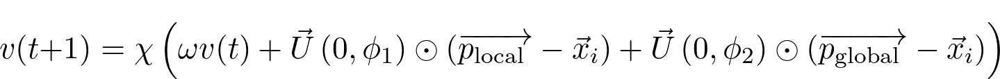
</p>

<sub>Se ofrecen tres opciones:</sub>

<p><ul><li><sub>
Inercia: Se multiplica a la velocidad previa por una constante denominada inercia (). Se ofrecen 5 tipos de inercia: Constante, Linealmente Decreciente, Decreciente Caótica, Aleatoria y Exponencial Natural. Para más información escribir en la ventana de comandos <tt>help ComputeInertia</tt>. La constante  se iguala a 1 para impedir la intervención de la restricción por constricción.
</sub></li></ul></p>

<p><ul><li><sub>
Constricción: Criterio de convergencia propuesto por Clerc (1999). Este criterio asegura la convergencia del algoritmo siempre y cuando  4"/>. La constante  se iguala a 1 para impedir la intervención de la restricción por inercia.
</sub></li></ul></p>

<p align="center">
   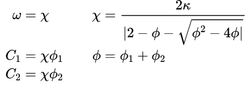
</p>

<p><ul><li><sub>
Mixto: Uso de inercia "Exponencial Natural" junto con los parámetros de constricción propuestos por Clerc (1999). Propuesto por Aldo en su tesis.
</sub></li></ul></p>

</details><br/>

<ins>*Settings de E-Pucks*</ins>

<details>
<summary> <tt>NoPucks</tt> </summary>
<sub> Cantidad de robots diferenciales a simular. No, no dice NoFucks.</sub>
</details>

<details>
<summary> <tt>EnablePucks</tt> </summary>
<sub> Si únicamente se desea visualizar el movimiento de las partículas en un método dependiente de PSO, se permite que el usuario desactive la simulación de los robots E-Puck.</sub>
<p align="center">
   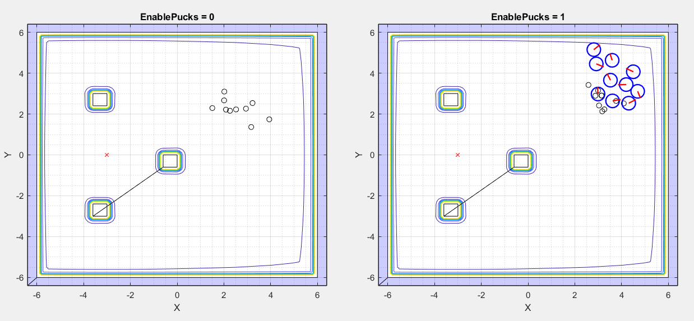
</p>
</details>

<details>
<summary> <tt>RadioLlantasPuck</tt> </summary>
<sub> Radio de las ruedas que emplea el robot diferencial. Unidades en metros. </sub>
</details>

<details>
<summary> <tt>RadioCuerpoPuck</tt> </summary>
<sub> Distancia del centro del robot a sus ruedas. Unidades en metros. </sub>
</details>

<details>
<summary> <tt>RadioDifeomorfismo</tt> </summary>
<sub> Al sacar la cinemática directa de un robot diferencial, el modelo derivado es altamente no lineal. Para poder aplicar control a dicho robot, entonces se supone que no se controlará la posición y velocidad del centro del robot como tal, sino de un punto delante de él (comúnmente ubicado en los extremos de su radio en caso se trate de un robot circular). La distancia que existe entre el centro del robot y este punto a controlar se le denomina radio de difeomorfismo. Unidades en metros. </sub>
</details>

<details>
<summary> <tt>PuckVelMax</tt> </summary>
<sub> Velocidad angular máxima que pueden alcanzar las ruedas del robot. Unidades en rad/s. </sub>
</details>

<details>
<summary> <tt>ControladorPucks</tt> </summary>
<sub> Controlador para el movimiento punto a punto de los E-Pucks. Existen 5 opciones. Basados en los controladores implementados por Aldo:</sub>

<p align="center">
   
</p>

<p><ul><li><sub>
Linear Quadratic Regulator (LQR): Movimiento rápido que desacelera conforme el robot se acerca a la meta. Para cambiar de dirección el robot se detiene completamente, gira y luego se mueve.
</sub></li></ul></p>

<p align="center">
   
</p>

<p><ul><li><sub>
Linear Quadratic Integral Control (LQI): Movimiento parecido al LQR, pero con una desaceleración menos pronunciada y sin giros agudos en el cambio de meta a meta. El robot no se detiene completamente para girar.
</sub></li></ul></p>

<p align="center">
   
</p>

<p><ul><li><sub>
Controlador de Pose Simple: Movimiento con velocidad menor a aquella observada en los controladores LQR y LQI. Debido a su aceleración angular menor, las trayectorias generadas son más suaves y largas.
</sub></li></ul></p>

<p align="center">
   
</p>

<p><ul><li><sub>
Controlador de Pose con Criterio de Estabilidad de Lyapunov: Misma velocidad que en el controlador de pose simple. Giros agudos, pero aceleraciones angulares bajas al momento de girar e iniciar el movimiento lineal.
</sub></li></ul></p>

<p align="center">
   
</p>

<p><ul><li><sub>
Controlador de Direccionamiento de Lazo Cerrado: Controlador con la menor velocidad de entre los 5 presentados. El robot busca alinear su dirección con la meta, pero no su sentido. Por lo tanto, no importando si su eje +X (línea rojo vivo del robot) o -X apunta en la dirección de la meta, este se moverá hacia la misma. Esto implica que según le sea conveniente, el robot se desplazará hacia adelante o en reversa hacia la meta. La aceleración angular es baja, produciendo giros sumamente suaves; no obstante, debido a la alta velocidad lineal asociada al movimiento, el robot tiende a desviarse ligeramente del punto hacia el que desea orientarse, causando que las trayectorias tengan una mayor longitud.
</sub></li></ul></p>

<sub> Entre estos, los dos mejores se consideran el LQI y LQR, con el peor siendo el de Closed-Loop Steering. Para más información escribir en consola <tt>help getControllerOutput</tt>. </sub>
</details>

<details>
<summary> <tt>CriterioPuck</tt> </summary>
<sub> Similar al parámetro <tt>CriterioPart</tt>. Determina el criterio de convergencia que utilizará el ciclo principal para determinar el momento en el que debe finalizar su ejecución según la posición de los robots diferenciales. Existen tres opciones: Meta Alcanzada, Entidades Detenidas e Iteraciones Max.</sub>
<p align="center">
   
</p>
</details><br/>

<ins>*Settings de Seguimiento de Trayectorias*</ins>

<details>
<summary> <tt>TrayectoriaCiclica</tt> </summary>
<sub> En métodos de seguimiento de trayectorias, el robot está activamente siguiendo un conjunto de puntos en orden secuencial. Si se establece que se desea una trayectoria cíclica, cuando el robot alcance el último punto de su trayectoria, este tomará como siguiente punto a seguir el primer punto en la trayectoria. Si la trayectoria no es cíclica, el último punto de la misma no cambia aunque se llegue a ella. </sub>
</details>

<details>
<summary> <tt>DemoMultimeta</tt> </summary>
<sub> El método "Demo Trayectorias" consiste de un método en el que un cierto número de robots (dado por la variable <tt>NoPucks</tt>) siguen una trayectoria común predeterminada por el usuario. Si <tt>DemoMultimeta = 1</tt>, entonces el número de robots se limitará a tres y cada uno de estos seguirá una meta distinta. </sub>
<p align="center">
   
    
</p>
</details><br/>

<ins>*Animación*</ins>

<details>
<summary> <tt>ModoVisualizacion</tt> </summary>
<sub> 2D, 3D o None. El modo 3D se recomienda para observar más fácilmente la forma de la función de costo en métodos dependientes de PSO. El 2D es más útil para observar el movimiento de las partículas y/o robots.</sub>
<p align="center">
   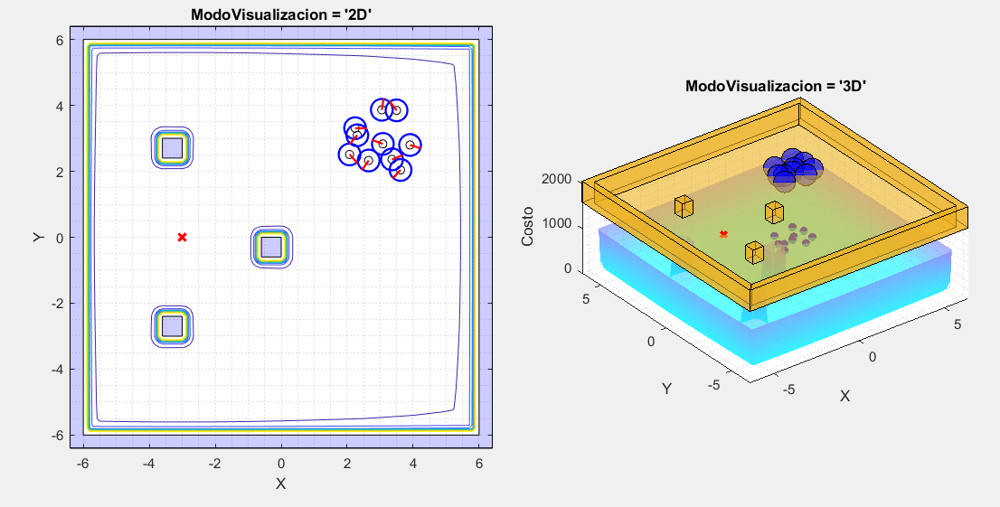
</p>
</details>

<details>
<summary> <tt>EnableRotacionCamara</tt> </summary>
<sub>Cuando Matlab grafica en 3D, este elige un ángulo óptimo para posicionar la cámara que enfoca el plot. Al habilitar esta opción, Matlab gira la cámara alrededor del plot a una velocidad constante. Únicamente válido para el modo de visualización 3D. </sub>
<p align="center">
   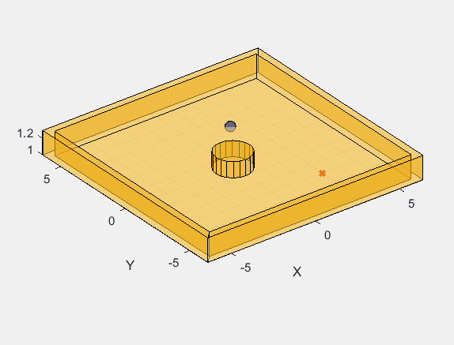
   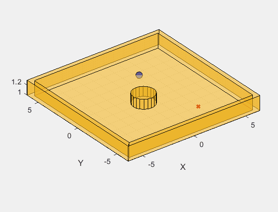
</p>
</details>

<details>
<summary> <tt>VelocidadRotacion</tt> </summary>
<sub>Cantidad de grados que rota la cámara alrededor del plot en cada iteración del main loop. Mientras más bajo el valor absoluto de esta cantidad más lenta será la rotación. Si la velocidad es positiva, la cámara rota a favor de las manecillas del reloj. Si la velocidad es negativa, la cámara rota en contra de las manecillas. </sub>
</details>

<details>
<summary> <tt>OverwriteTitle</tt> </summary>
<sub>Por defecto, la simulación utiliza el título como un cronómetro o contador para el tiempo de simulación. Si <tt>OverwriteTitle = 1</tt> se reemplaza este contador por un string dado por el usuario. </sub>
</details>

<details>
<summary> <tt>OverwriteTitle_String</tt> </summary>
<sub> String que reemplaza el título por defecto de la simulación si <tt>OverwriteTitle = 1</tt>. </sub>
</details><br/>

<ins>*Obstáculos*</ins>

<details>
<summary> <tt>TipoObstaculo</tt> </summary>
<sub>Tipo de obstáculo a colocar en la mesa de trabajo. Existen 5 opciones:</sub>

<p><ul><li><sub>
Polígono: El usuario puede dibujar el polígono que desee. La interfaz de creación incluye la región de partida y el/los puntos meta para que el usuario evite colocar el obstáculo sobre estos (aunque aún puede hacerlo). Para cerrar el polígono y finalizar la creación del obstáculo, se puede dar doble click en cualquier parte del plot o se puede hacer click sobre el primer vértice colocado. Una vez creado el polígono, este no puede moverse. Esta herramienta solo es capaz de crear un solo polígono (no importando su complejidad). Si se desean crear múltiples polígonos, se recomienda utilizar la herramienta de Imagen.
</sub></li></ul></p>

<p align="center">
   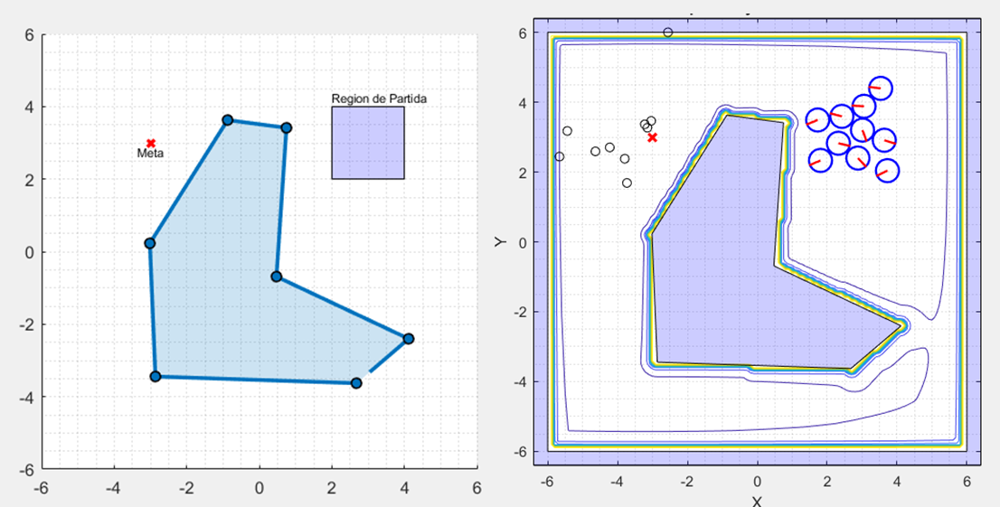
</p>

<p><ul><li><sub>
Cilindro: Coloca un cilindro en el centro de la mesa de trabajo. El radio puede cambiarse manualmente alterando el parámetro <tt>RadioObstaculo</tt>.
</sub></li></ul></p>

<p align="center">
   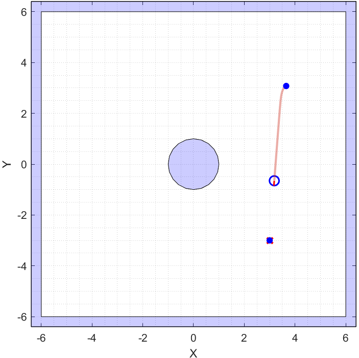
</p>

<p><ul><li><sub>
Imagen: El usuario puede tomar una imagen en blanco y negro de un mapa (con los obstáculos en negro y el espacio vacío en blanco), colocarla en el directorio base del script principal (o dentro de la carpeta <tt>.../Mapas/Imágenes</tt>) y luego procesarla para convertirla en un obstáculo utilizable dentro del Toolbox.
<br/><br/>Para su funcionamiento, esta herramienta hace uso de la función <tt>ImportarMapa.m</tt>. Dicha función toma como entrada una imagen y extrae los vértices de los obstáculos presentes en la imagen. Este proceso puede llegar a tomar mucho tiempo según la complejidad del obstáculo, entonces la función puede revisar si ya existen datos previamente procesados de la imagen elegida por el usuario. Si este es el caso, el usuario puede elegir reutilizar los datos guardados para así evitar la carga computacional asociada. También se incluyen medidas para revisar el nivel de similitud de la imagen elegida con el de las imágenes guardadas. Si es lo suficientemente parecido, el programa nuevamente pregunta si el usuario desea reutilizar datos previos.
<br/><br/>Si se desea comprender más a profundidad la forma en la que funciona dicha función (o refinar el montón de parámetros de los que depende la función), existe una versión alternativa (<tt>.../Ejemplos y Scripts Auxiliares/Importador_Mapas.mlx</tt>) con figuras y métodos alternativos para realizar el mismo proceso de extracción de vértices.
</sub></li></ul></p>

<p align="center">
   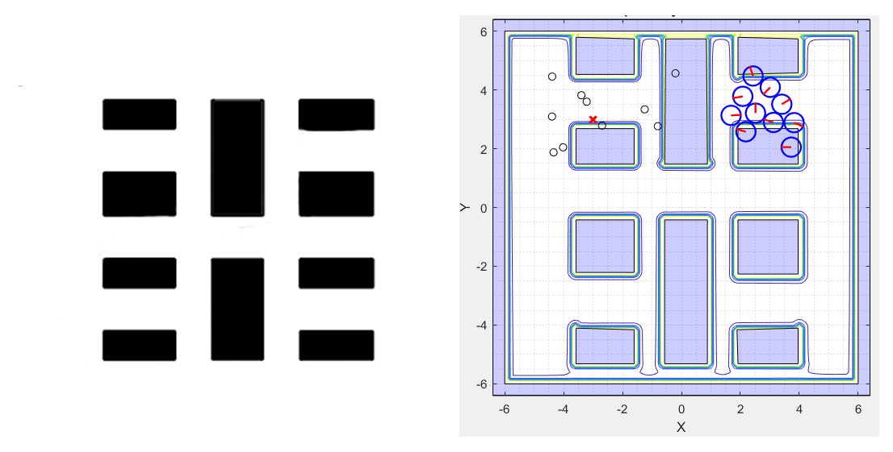
</p>

<p><ul><li><sub>
Caso A: Réplica del escenario A utilizado en la tesis de Juan Pablo.
</sub></li></ul></p>

<p align="center">
   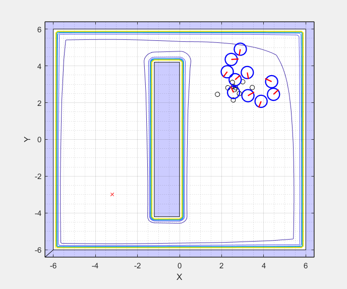
</p>

<p><ul><li><sub>
Caso B: Réplica del escenario B utilizado en la tesis de Juan Pablo.
</sub></li></ul></p>

<p align="center">
   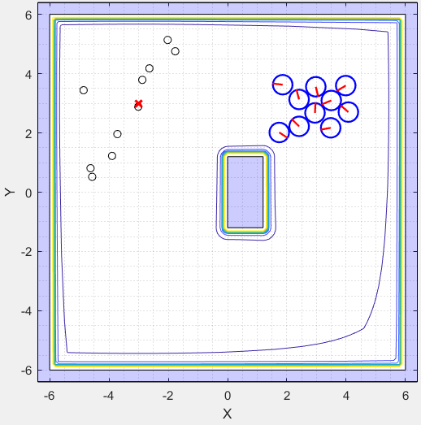
</p>

<p><ul><li><sub>
Caso C: Réplica del escenario C utilizado en la tesis de Juan Pablo.
</sub></li></ul></p>

<p align="center">
   
</p>

</details>

<details>
<summary> <tt>RadioObstaculo</tt> </summary>
<sub> Radio de obstáculo "Cilindro". </sub>
<p align="center">
   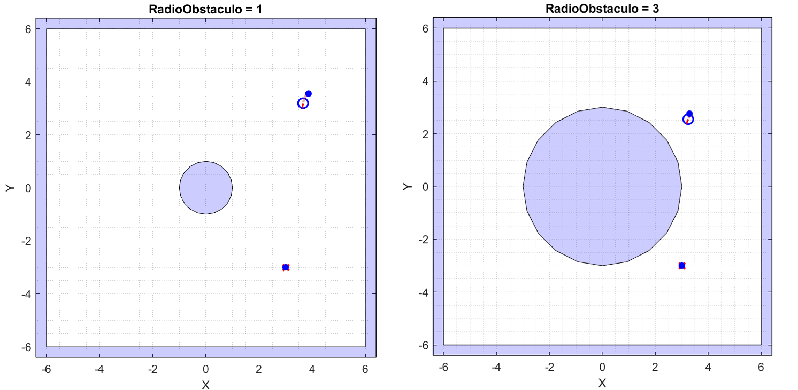
</p>
</details>

<details>
<summary> <tt>AlturaObstaculo</tt> </summary>
<sub> Altura de los obstáculos en el modo de visualización 3D. </sub>
<p align="center">
   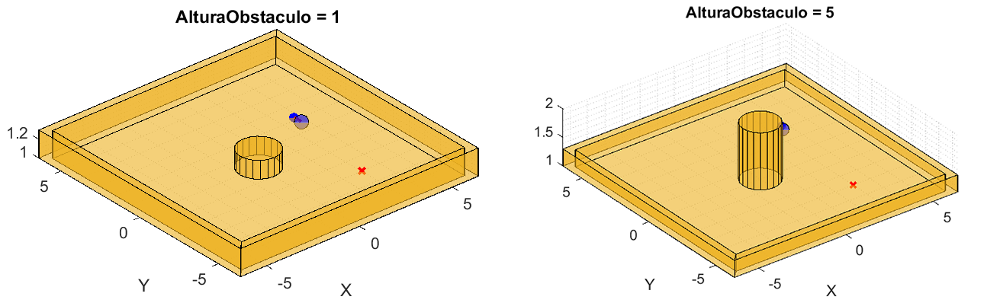
</p>
</details>

<details>
<summary> <tt>OffsetObstaculo</tt> </summary>
<sub> Altura por encima del "suelo de la mesa" donde se colocará la base de los obstáculos en el modo de visualización 3D. </sub>
<p align="center">
   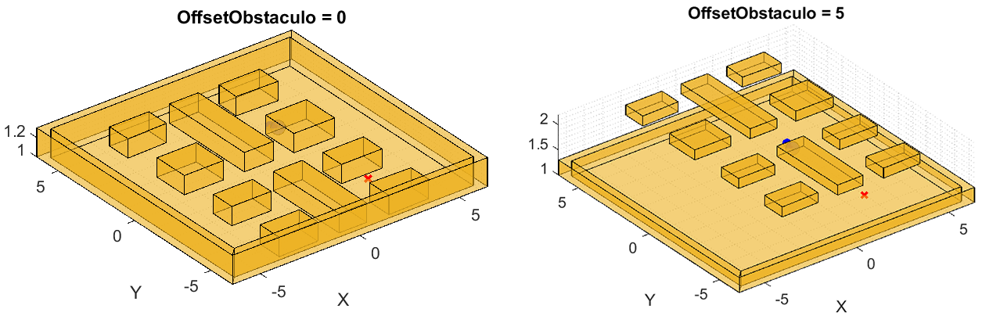
</p>
</details>

<details>
<summary> <tt>NombreImagenMapa</tt> </summary>
<sub> Nombre de la imagen en blanco y negro que buscará la función <tt>ImportarMapa.m</tt> al momento de generar/cargar los vértices de los obstáculos en la mesa de trabajo. </sub>
</details><br/>

<ins>*Meta y Región de Partida*</ins>

<details>
<summary> <tt>Meta</tt> </summary>
<sub> Coordenadas (X,Y) para el punto meta que buscarán alcanzar los robots diferenciales. </sub>
<p align="center">
   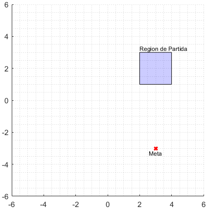
</p>
</details>

<details>
<summary> <tt>RegionPartida_Centro</tt> </summary>
<sub> Coordenadas (X,Y) para el centro del rectángulo que define la región de partida o la región dentro de la cual saldrán los robots y/o partículas PSO. </sub>
<p align="center">
   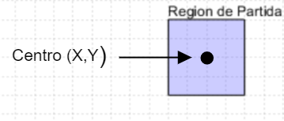
</p>
</details>

<details>
<summary> <tt>RegionPartida_Ancho</tt> </summary>
<sub> Ancho del rectángulo que define la región de partida o la región de la cual saldrán los robots y/o partículas PSO. </sub>
<p align="center">
   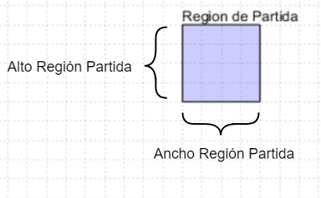
</p>
</details>

<details>
<summary> <tt>RegionPartida_Alto</tt> </summary>
<sub> Alto del rectángulo que define la región de partida o la región de la cual saldrán los robots y/o partículas PSO. </sub>
<p align="center">
   
</p>
</details><br/>

<ins>*Guardado de Animación*</ins>

<details>
<summary> <tt>SaveFrames</tt> </summary>
<sub> Permite guardar la animación de la simulación actual como una secuencia de imágenes PNG. Todas las imágenes son colocadas dentro del folder <tt>.../Media/Frames/NombreSimulacion/</tt>. Esta opción existe porque uno puede crear un GIF en Overleaf subiendo a una carpeta todas las imágenes y luego incluyendo el paquete "animate". El folder donde se guardan las imágenes es nombrado automáticamente según algunas propiedades de la simulación (Método, modo de visualización, etc.).</sub>
</details>

<details>
<summary> <tt>SaveVideo</tt> </summary>
<sub> Permite guardar la animación de la simulación actual como un video. El video se guarda en el folder <tt>.../Media/Video/</tt>. El archivo es nombrado automáticamente según algunas propiedades de la simulación (Método, modo de visualización, etc.). </sub>
</details>

<details>
<summary> <tt>SaveGIF</tt> </summary>
<sub> Permite guardar la animación de la simulación actual como un GIF. El GIF se guarda en el folder <tt>.../Media/GIF/</tt>. El archivo es nombrado automáticamente según algunas propiedades de la simulación (Método, modo de visualización, etc.).</sub>
</details>

<details>
<summary> <tt>SaveFigures</tt> </summary>
<sub> Permite guardar todas las figuras generadas durante la ejecución del script como imágenes PNG. Todas las figuras se guardan en el folder <tt>.../Media/Figuras/NombreSimulacion/</tt>. Para que el sistema de guardado funcione la figura creada debe ser asignada a una variable (Por ejemplo: <tt>Figura = figure('Name',"Plot Figura")</tt>). Si no se hace esto, la función encargada (<tt>saveWorkspaceFigures.m</tt>) no detectará la figura. El folder donde se guardan las figuras es nombrado automáticamente según algunas propiedades de la simulación (Método, modo de visualización, etc.).</sub>
</details>

<details>
<summary> <tt>EnableAnotacion</tt> </summary>
<sub> Agrega un string adicional al final del nombre del archivo/folder a guardar. Por ejemplo: La simulación tiene un error que se quiere documentar. Se puede hacer que <tt>EnableAnotacion = 1</tt> y <tt>AnotacionOutputMedia = "_Error"</tt>. Esto hará que el nombre del medio a guardar pase de <tt>Medio</tt> a <tt>Medio_Error</tt>. Útil para explicar un poco más de que se tratan los medios guardados. </sub>
</details>

<details>
<summary> <tt>EnableSubfolder</tt> </summary>
<sub> Opción que coloca el archivo o folder actual dentro de una subcarpeta madre dada por el parámetro <tt>SubfolderMedia</tt>. Por ejemplo: Se habilita este parámetro y se especifica que <tt>SubfolderMedia = "Experimento 1"</tt>. Cada vez que se guarde un archivo, este se colocará dentro de la carpeta "Experimento 1". Útil para agrupar experimentos de la misma naturaleza dentro de una misma carpeta. </sub>
</details>

<details>
<summary> <tt>AnotacionOutputMedia</tt> </summary>
<sub> String agregado al final del nombre del medio a guardar en caso <tt>EnableAnotacion = 1</tt>. </sub>
</details>

<details>
<summary> <tt>SubfolderMedia</tt> </summary>
<sub> Nombre del subfolder en el que se guardarán todos los medios generados en caso <tt>EnableSubfolder = 1</tt>. </sub>
</details>

<details>
<summary> <tt>PathGIF</tt> </summary>
<sub> Ruta base en la que se guardarán todos los GIFs generados por el Toolbox. </sub>
</details>

<details>
<summary> <tt>PathVideo</tt> </summary>
<sub> Ruta base en la que se guardarán todos los videos generados por el Toolbox. </sub>
</details>

<details>
<summary> <tt>PathFrames</tt> </summary>
<sub> Ruta base en la que se guardará la carpeta conteniendo todas las frames generadas por el Toolbox. </sub>
</details>

<details>
<summary> <tt>PathFrames</tt> </summary>
<sub> Ruta base en la que se guardará la carpeta conteniendo todas las figuras generadas y guardadas por la Toolbox. </sub>
</details><br/>

<ins>*Seed Settings*</ins>

<details>
<summary> <tt>SeedManual</tt> </summary>
<sub> La seed consiste del número que se utiliza para generar valores aleatorios en Matlab (al llamar funciones como <tt>randn()</tt> o <tt>randi()</tt>). Si <tt>SeedManual = 1</tt> el usuario puede elegir y fijar la seed que utilizará Matlab por medio del parámetro <tt>Seed</tt>. Si <tt>SeedManual = 0</tt>, entonces el parámetro <tt>Seed</tt> consistirá de la seed elegida arbitrariamente por Matlab. </sub>
</details>

<details>
<summary> <tt>Seed</tt> </summary>
<sub> Número utilizado para generar valores aleatorios en Matlab. Según el valor de <tt>SeedManual</tt> esta puede consistir de un valor especificado por el usuario o de un valor elegido arbitrariamente por Matlab. </sub>
</details><br/>

### Reglas de Método a Usar

<p align="center">
   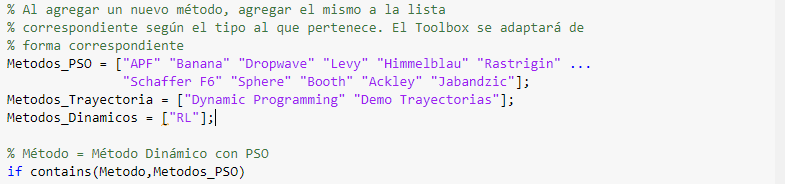
</p>

Los métodos disponibles se pueden agrupar en 3 tipos:

- **Seguimiento de Trayectoria**: Utiliza información del mapa para generar una trayectoria desde la región de partida hasta la meta. Un controlador punto a punto mueve al robot.
- **Exploración con PSO**: Los robots exploran el mapa usando una función de costo optimizada por partículas PSO. La función de costo necesita de conocimiento previo sobre el ambiente.
- **Exploración Dinámica**: Exploración basada solamente en las lecturas actuales de sensores. No se requiere de conocimiento previo sobre el ambiente.

Según el método elegido (parámetro <tt>Metodo</tt>) el Toolbox toma decisiones sobre el valor de diferentes propiedades e incluso puede llegar a sobre-escribir valores previamente especificados por el usuario en la sección de [parámetros y settings](#parámetros-y-settings).

**NOTA**: Si agrega un nuevo método de navegación, es muy importante añadir el nombre del mismo a alguna de las listas al inicio de la sección, de lo contrario el programa retornará un error.

### Región de Partida y Obstáculos de Mesa

Se crea el vector que contiene los límites de la región de partida de los robots / partículas (`RegionPartida_Bordes`) y luego, según el `TipoObstaculo`, el programa extrae los vértices propios de él o los obstáculos a posicionar en la mesa de trabajo (`XObs`, `YObs` y `ZObs`).

```Matlab
% Forma estándar del array XObs
XObs = [VertX1_Polygono1   VertX1_Polygono1
        VertX2_Polygono1   VertX2_Polygono1
        VertX3_Polygono1   VertX3_Polygono1
        VertX4_Polygono1   VertX4_Polygono1
        NaN                NaN
        VertX1_Polygono2   VertX1_Polygono2
        VertX2_Polygono2   VertX2_Polygono2
        VertX3_Polygono2   VertX3_Polygono2
        VertX4_Polygono2   VertX4_Polygono2
        NaN                NaN             ];

% Forma estándar del array YObs
YObs = [VertY1_Polygono1   VertY1_Polygono1
        VertY2_Polygono1   VertY2_Polygono1
        VertY3_Polygono1   VertY3_Polygono1
        VertY4_Polygono1   VertY4_Polygono1
        NaN                NaN
        VertY1_Polygono2   VertY1_Polygono2
        VertY2_Polygono2   VertY2_Polygono2
        VertY3_Polygono2   VertY3_Polygono2
        VertY4_Polygono2   VertY4_Polygono2
        NaN                NaN             ];
```

Aunque el obstáculo seleccionado consista de múltiples polígonos, todos sus vértices se incluirán dentro de las variables `XObs`, `YObs` y `ZObs`. Para diferenciar entre los vértices de diferentes polígonos se separa a cada grupo de vértices por medio de una fila de `NaN`.

```Matlab
% Forma estándar del array ZObs
ZObs = [VertZ1_Bottom_Polygono1   VertZ1_Top_Polygono1
        VertZ2_Bottom_Polygono1   VertZ2_Top_Polygono1
        VertZ3_Bottom_Polygono1   VertZ3_Top_Polygono1
        VertZ4_Bottom_Polygono1   VertZ4_Top_Polygono1
        NaN                       NaN
        VertZ1_Bottom_Polygono2   VertZ1_Top_Polygono2
        VertZ2_Bottom_Polygono2   VertZ2_Top_Polygono2
        VertZ3_Bottom_Polygono2   VertZ3_Top_Polygono2
        VertZ4_Bottom_Polygono2   VertZ4_Top_Polygono2
        NaN                       NaN                 ];
```

Cabe mencionar que las variables `XObs` y `YObs` son matrices de dos columnas, donde ambas columnas son iguales. Esto se debe a que en la visualización 3D, el polígono 2D base se "extruye" en la dirección del eje Z+, creando una cara *superior* con las mismas coordenadas X y Y que el polígono original. De aquí que `XObs`, `YObs` y `ZObs` tengan dos columnas: La primera consiste de los vértices del polígono base o *cara inferior* y la segunda de los vértices de la *cara superior*. A su vez, es por esto que `ZObs` tiene valores diferentes para cada columna: La columna 1 es la altura de la *cara inferior* y la columna 2 es la altura de la *cara superior*. Una visualización de todas estas cantidades se pueden observar a continuación:

<p align="center">
   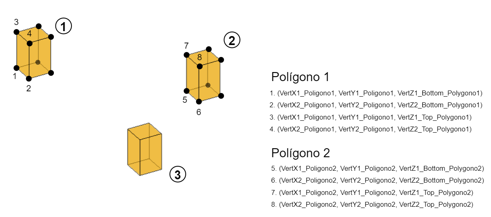
</p>

### Inicialización de Robots

Se inicializan las posiciones, velocidades y orientaciones de todos los robots diferenciales a simular. También se inicializan las matrices *historial* que se encargarán de almacenar el valor de las posiciones y velocidades durante cada iteración del algoritmo.

`PuckPosicion_Actual` es una matriz de `NoPucks X 2`, con la columna 1 conteniendo las coordenadas X y la columna 2 las coordenadas Y. Cada fila corresponde a un E-Puck diferente. Los valores iniciales de estas coordenadas consisten de valores aleatorios uniformemente distribuidos (`unifrnd()`) dentro de los límites de la región de partida. Si alguna posición se encuentra dentro de un obstáculo, se genera una nueva posición inicial aleatoria hasta que la posición se encuentre fuera del obstáculo. Este método de corrección a *fuerza bruta* funciona bien pero puede causar problemas ya que si los obstáculos son muy complejos (o su overlap con la región de partida es muy grande), a Matlab le puede tomar un **muuuuy largo tiempo** corregir las posiciones, potencialmente trabando al programa en el proceso.

``` Matlab
% Forma estándar de "PuckPosicion_Actual"

PuckPosicion_Actual = [X1     Y1          % EPuck 1
                       X2     Y2          % EPuck 2
                       X3     Y3          % EPuck 3
                       ...    ...
                       XN     YN];        % EPuck N
```

`PuckOrientacion_Actual` dicta la dirección en la que apunta cada uno de los E-Pucks. Los ángulos están medidos en radianes e inician en el eje X+, creciendo cuando se rota en contra de las manecillas del reloj y disminuyendo cuando se rota a favor de las mismas. Cabe mencionar que los ángulos no están acotados por lo que si un robot comienza a girar en contra de las manecillas del reloj, por ejemplo, el valor de su orientación comenzará a crecer infinitamente. Dado que para cada E-Puck existe un único ángulo, la variable `PuckOrientacion_Actual` consiste de un vector columna de `NoPucks X 1`. En el Toolbox, la orientación se visualiza por medio de una línea roja que parte del centro de cada E-Puck.

``` Matlab
% Forma estándar de "PuckOrientacion_Actual"

PuckOrientacion_Actual = [Ángulo1        % EPuck 1
                          Ángulo2        % EPuck 2
                          Ángulo3        % EPuck 3
                          ...
                          ÁnguloN];      % EPuck N
```

<p align="center">
   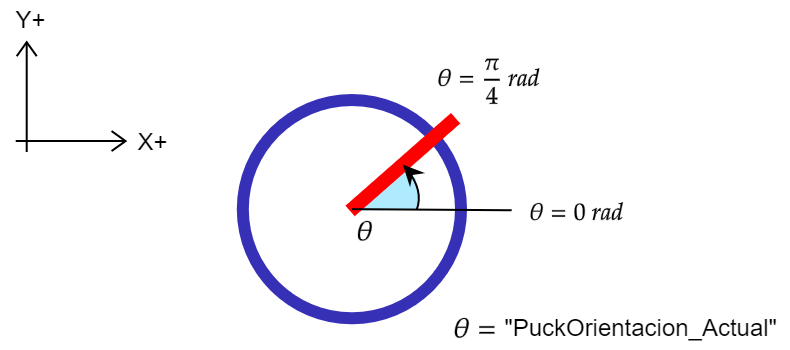
</p>

`PuckVel_Lineal` y `PuckVel_Angular` describen la velocidad lineal y angular de cada E-Puck respectivamente. Ambos son vectores columna de `NoPucks X 1`. La velocidad lineal consiste de la velocidad a la que se mueven los E-Pucks en la dirección de `PuckOrientacion_Actual`. La velocidad angular, por otro lado, consiste de la tasa de cambio para `PuckOrientacion_Actual`.

``` Matlab
% Forma estándar de "PuckVel_Lineal"

PuckVel_Lineal = [VelLin1        % EPuck 1
                  VelLin2        % EPuck 2
                  VelLin3        % EPuck 3
                  ...
                  VelLinN];      % EPuck N

% Forma estándar de "PuckVel_Angular"

PuckVel_Lineal = [VelAng1        % EPuck 1
                  VelAng2        % EPuck 2
                  VelAng3        % EPuck 3
                  ...
                  VelAngN];      % EPuck N
```

### Setup: Métodos PSO

#### Parámetros Ambientales

La función `CostFunction.m` maneja los cálculos relacionados a las funciones de costo de todos los métodos dependientes de PSO no importando su complejidad. Una desventaja de esto, es que algunas funciones de costo requieren de más o menos parámetros de entrada. En particular, los métodos de *Jabandzic* y *APF* requieren de una gran cantidad de datos adicionales a diferencia de las funciones *Benchmark*. Para solucionar esto, a la función `CostFunction` se le puede llegar a pasar un *cell array* denominado `EnvironmentParams` o parámetros del entorno.

El contenido de este array tiene un orden definido y según el método elegido, puede contener más o menos parámetros. Estas son las diferentes formas que puede cobrar el *cell array*:

``` Matlab
% Método = APF
EnvironmentParams = {VerticesObsX, VerticesObsY, LimsX_Mesa, LimsY_Mesa, Meta};

% Método = Jabandzic
EnvironmentParams = {VerticesObsX, VerticesObsY, LimsX_Mesa, LimsY_Mesa, Meta, PuckPosicion_Actual, PosicionPuckObstaculo};

% Método = Función Benchmark
EnvironmentParams = {};
```

No se debe cambiar el orden de estos parámetros o el algoritmo retornará cosas raras. Una posible mejora podría ser que `CostFunction.m` no tome los elementos de `EnvironmentParams` como inputs opcionales, sino que los tome como parámetros. Esto causaría que `EnvironmentParams` crezca (porque tendría que contener el nombre del parámetro, seguido de su valor) pero daría mayor flexibilidad para la implementación de futuros métodos que no requieran de los mismos parámetros que *APF* y *Jabandzic* por ejemplo.

#### Barrido de la Superficie de Costo

Para graficar la función de costo elegida se debe obtener el costo o *altura* de la superficie en cada punto del plano (X,Y). Para aproximar "todos los puntos del plano" se genera una malla o `meshgrid()` de puntos que se extiende desde el límite inferior al límite superior de cada eje. La separación entre puntos está dado por `Resolucion`. Si se toman las coordenadas de todos los puntos de esta malla y se evalúan en `CostFunction`, se obtienen las alturas de la superficie de costo.

Esta evaluación inicial solo tiene un propósito estético para la mayor parte de funciones de costo. La única excepción a esta regla es la función *APF*, la cual utiliza la evaluación inicial como una pre-computación de los valores de costo. La evaluación inicial guarda en memoria los valores de costo y durante el main loop solo extrae los valores requeridos (ya que calcular los mismos durante el main loop podría tomar mucho tiempo).

El programa también extrae la/las metas de la función de costo en caso la misma consista de una función de costo Benchmark. Si este no es el caso, se utiliza la meta elegida por el usuario.

#### Inicialización del PSO y Restricciones del Algoritmo

Se crea un objeto de tipo PSO (`Part = PSO()`) con el número especificado de partículas, dimensiones, función de costo a optimizar, criterio de convergencia, número máximo de iteraciones y límites de la región de búsqueda. Seguido de esto se inicializan las variables internas del algoritmo (`Part.InitPSO()`) y se establecen las restricciones que se van a utilizar (`Part.SetRestricciones()`).

### Setup: Dynamic Programming

#### Creación de Cuadrícula

### Colisiones

Un entorno de simulación realista es necesario para obtener resultados útiles al momento de realizar pruebas. Debido a esto, se implementó "Collision Detection" entre los robots. Durante cada iteración, los robots revisan la distancia entre ellos (Para más información escribir en consola: *`help getDistsBetweenParticles`*) y si esta es menor a 2 radios de E-Puck, los robots se clasifican como "en colisión". Seguido de esto se procede resolver las colisiones, alejando a los robots el uno del otro hasta eventualmente resolver todas las colisiones existentes.

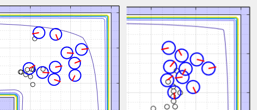

Desgraciadamente, debido a que al alejar un robot del otro se pueden llegar a crear más colisiones, en algunas ocasiones el algoritmo puede no converger en una solución. Por lo tanto, **el algoritmo implementado es inestable y si no se restringe puede llegar a trabar Matlab.** Para controlar esto se le colocó un número máximo de iteraciones en las que puede llegar a producir una solución válida. Con esta "solución", el algoritmo funciona relativamente bien aunque puede producir errores frecuentemente.

Si se desea, el usuario puede acceder a la función *`SolveCollisions.m`* y cambiar el parámetro IteracionesMax. Los errores disminuyen al incrementar el número de iteraciones, pero el tiempo computacional requerido incrementa. En futuras versiones del Toolbox se desea implementar un algoritmo de "Collision Detection" mucho más robusto como "Speculative Collisions" que también incluya elementos como las paredes o los obstáculos como tal.

### Controladores

Como es explicado por Aldo en su tesis, el acoplar el movimiento de un robot diferencial directamente al desplazamiento de una partícula PSO no es recomendable. Las partículas se desplazan de manera muy agresiva, por lo que los robots podrían quemar sus motores en el proceso de intentar seguir su paso. Entonces, los E-Pucks no siguen directamente las posiciones de las partículas PSO, sino que utilizan su dirección como una sugerencia de hacia donde ir. Debido a esta diferencia, a las partículas del algoritmo PSO se les pasa a denominar "Marcadores PSO" en el Toolbox.

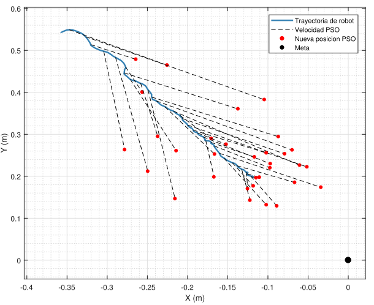

Los controladores son los encargados de seguir estas sugerencias hasta llegar a la meta. En la Toolbox se ofrecen dos opciones: Un controlador LQR y un LQI (Ya que estos fueron los que obtuvieron los mejores resultados en la tesis de Aldo). La salida de estos controladores es la velocidad lineal y angular de los E-Pucks. Normalmente estas cantidades deben ser mapeadas por medio de estas ecuaciones

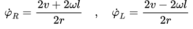

a las velocidades angulares de las ruedas del robot. No obstante, en el caso de la Toolbox, las velocidades se utilizan directamente para guiar el movimiento de los robots. Para más información escribir en consola *`help getControllerOutput`*

### Análisis de Resultados

Al finalizar la simulación, el usuario puede analizar los resultados obtenidos haciendo uso de 4 gráficas distintas

#### Evolución del Global Best

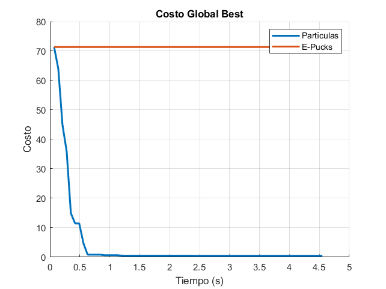

Utilizada para determinar si los robots y las partículas efectivamente minimizan la función de costo que se eligió. Dada la naturaleza del movimiento de los robots, muy comúnmente la curva de los robots parece estar "atrasada" con respecto a la de las partículas o marcadores PSO.

#### Análisis de Dispersión de Partículas

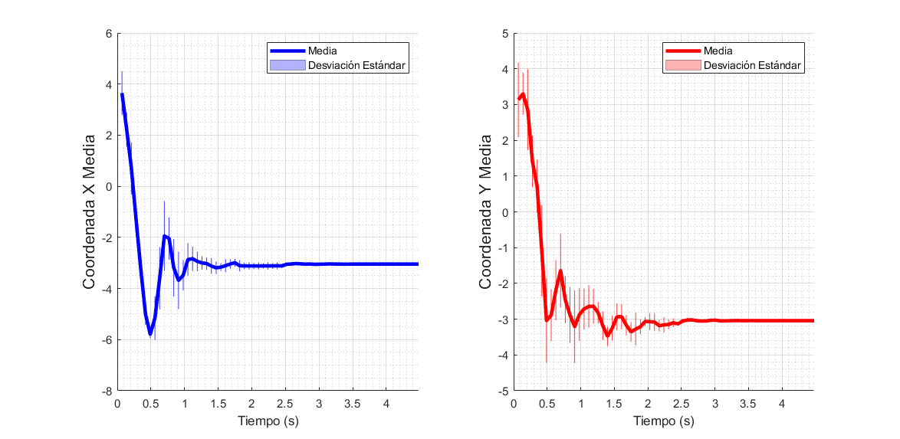

Dos cualidades importantes de las partículas del PSO es su capacidad de exploración y la precisión de su minimización. Con estas gráficas, la precisión se puede evaluar viendo la línea gruesa coloreada y la exploración utilizando las líneas correspondientes a la desviación estándar.  Si las líneas gruesas se estabilizan en las coordenadas de la meta, las partículas son precisas. Si la desviación estándar es muy pronunciada, las partículas exploran minuciosamente el área de trabajo antes de converger.

En el caso presentado, por ejemplo, las partículas son precisas y convergen con rapidez, aunque exploran poco.

#### Velocidad de Motores

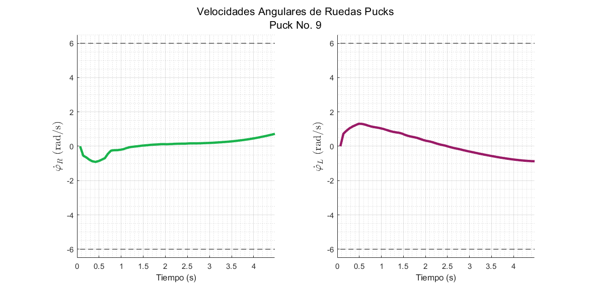

Utilizando la cinemática inversa de un robot diferencial se calculan las velocidades angulares de las ruedas de todos los robots.


La Toolbox obtiene las velocidades angulares medias de todas las ruedas y determina cual fue el robot con las velocidades más altas. Toma este robot como selección y grafica la evolución de las velocidades angulares de sus dos ruedas. Útil para analizar si los actuadores del robot crítico presentan saturación. Como ayuda se incluyen líneas punteadas, las cuales consisten de los límites de velocidad con los que cuenta el robot (Basado en *`PuckVelMax`*). 

#### Suavidad de Velocidades

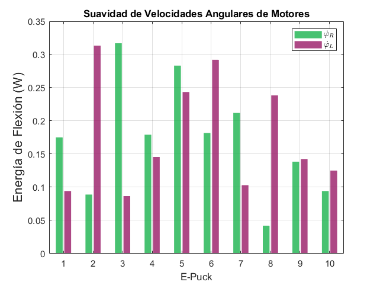

Basado en el criterio de evaluación empleado por Aldo en su tesis. Se realiza una interpolación de los puntos que conforman la curva de velocidades angulares de las ruedas, y luego se calcula la energía de flexión de la curva. Si la energía de flexión es baja, la suavidad de operación es mucho mayor. Prueba ideal para diagnosticar cuantitativamente la suavidad de operación.

### Grabación de Videos / Frames

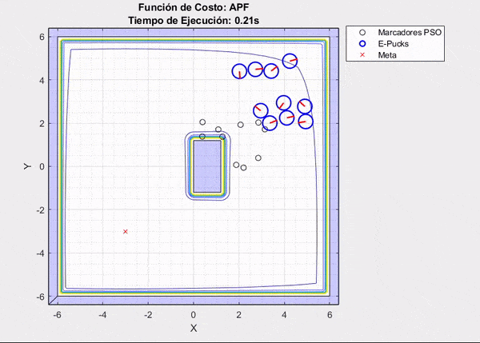

Para facilitar la presentación de resultados, la Toolbox cuenta con dos opciones de exportación de gráficas: *`SaveVideo`* y *`SaveFrames`*.

- SaveFrames: Guarda cada una de las frames generadas durante el proceso de animación en el directorio raíz.  
- SaveVideo: Crea un video a partir de las frames generadas durante el proceso de animación. Por defecto el framerate es de 30 y el formato es mp4.

**Advertencia**: Durante el proceso de creación de videos, la animación corre más lento.

## Demostración

### Partículas Esquivando Obstáculo

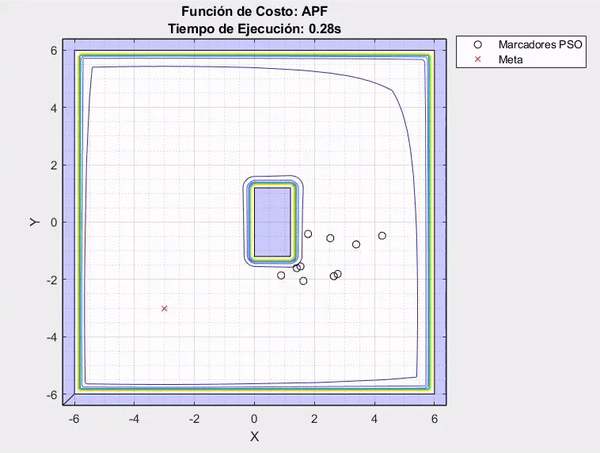
  
### Polígono Personalizado


