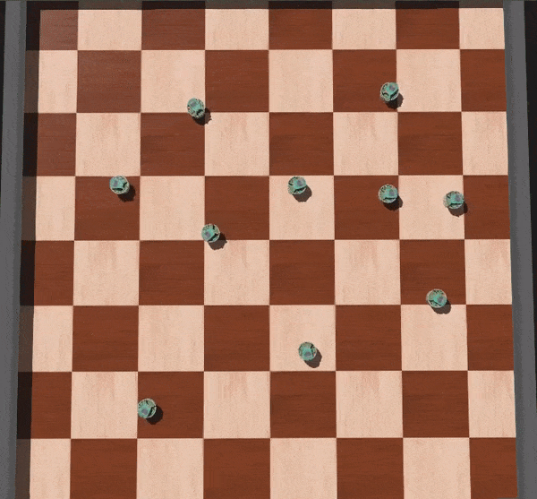
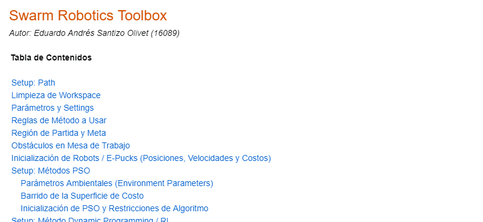
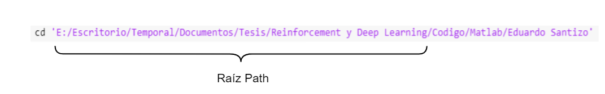
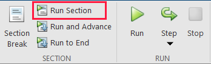
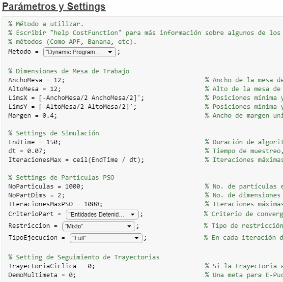
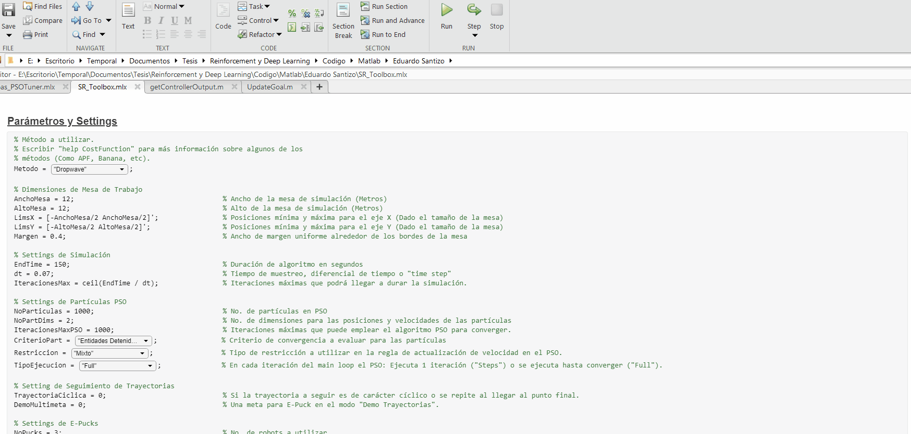

# Reinforcement y Deep Learning en Aplicaciones de Robótica de Enjambre

   
    

## Índice

1. [Estructura de Carpetas](#estructura-de-carpetas)
2. [Antecedentes](#antecedentes)
   - [Aldo Aguilar (2019)](#aldo-aguilar-2019)
   - [Juan Pablo Cahueque (2019)](#juan-pablo-cahueque-2019)
   - [Eduardo Santizo (2020)](#eduardo-santizo-2020)
3. [Guía de Uso](#guía-de-uso)
4. [Hardware y Software](#hardware-y-software)
5. [Swarm Robotics Toolbox](#swarm-robotics-toolbox)
   - [Estructura de Programa](#estructura-de-programa)
   - [Funciones](#funciones)
     - [Evolución del Global Best](#evolución-del-global-best)
     - [Análisis de Dispersión de Partículas](#análisis-de-dispersión-de-partículas)
     - [Velocidad de Motores](#velocidad-de-motores)
     - [Suavidad de Velocidades](#suavidad-de-velocidades)
   - [Grabación de Videos / Frames](#grabación-de-videos--frames)
6. [Demostración](#demostración)
   - [Partículas Esquivando Obstáculo](#partículas-esquivando-obstáculo)
   - [Polígono Personalizado](#polígono-personalizado)

## Estructura de Carpetas

 

Repositorio (Click para más info.) 

Estructura general de las carpetas existentes en el repositorio.
<pre><code> Reinforcement y Deep Learning
│
└─── Código
│   │
│   └─── Matlab
|   |   |
│   |   └─── Aldo Aguilar:
|   |   |    Pruebas parámetros PSO
|   |   |
│   |   └─── Juan Cahueque:
|   |   |    Pruebas APF
|   |   |
│   |   └─── Eduardo Santizo:
|   |        PSO Toolbox y PSO Tuner
|   |
│   └─── Webots
|       |
│       └─── Aldo Aguilar:
|       |    Simulación controladores E-Pucks y scripts de análisis de resultados.
|       |
│       └─── Juan Cahueque:
|            Simulación caso A, B y C.
|
|
└─── Literatura
│   │
│   └─── Lectures:
|   |    Clases, presentaciones o lecciones
|   |
│   └─── Libros
|   |
│   └─── Papers
│   |   │
│   |   └─── Artificial Potential Fields
|   |   |
│   |   └─── Interpolaciones
|   |   |
│   |   └─── Machine Learning
|   |   |
│   |   └─── Robótica
|   |   |
│   |   └─── Swarm Intelligence
|   |
|   |
│   └─── Tesis Previas:
|   |    PDFs de trabajos de graduación y protocolos previos.
|   |
│   └─── Referencias Bibtex:
|        Archivo .bib con las referencias a toda la literatura.
|
|
└─── Notas:
|    Imágenes y documentos varios con notas sobre el proyecto.
|
|
└─── Reporte:
|    Documentos asociados con la redacción del reporte final de tesis y el protocolo.
|
|
└─── Media:
     Imágenes y GIFs utilizados en el Readme.
</code></pre>

 

 

Tesis Eduardo Santizo (Click para más info.) 

Estructura para la carpeta que contiene el código de Matlab de la tesis "Reinforcement y Deep Learning en Aplicaciones de Robótica de Enjambre" realizada por Eduardo Santizo.
<pre><code>Eduardo Santizo
│
└─── Deep PSO Tuner
│   │
│   └─── Datasets:
|   |    Datos de entrenamiento y validación para las RNNs
│   │
│   └─── Modelos:
|   |    Modelos finales para las redes entrenadas
│   │
│   └─── Settings y Training Progress:
|        Modelos, estructuras de red e imágenes de progreso de entrenamiento.
|        Excel con registro del proceso de hyperparameter tuning para cada RNN.
|
|
└─── Ejemplos y Scripts Auxiliares
│   │
│   └─── Reinforcement Learning Coursera - Ejercicios:
|   |    Ejercicios (Matlab) para el curso de Reinforcement Learning impartido por la Universidad de Alberta.
|   |
│   └─── Sequence to Sequence Regression Using Deep Learning:
|   |    Ejemplo de Matlab para entrenar una RNN para predecir una secuencia.
|   |
│   └─── Importador_Mapas.mlx:
|   |    Versión mejor explicada de la función interna "ImportarMapa()".
|   |
│   └─── Train_Shallow&DeepNN_DatosSecuenciales:
|        Predicción de un sistema de ecuaciones diferenciales usando una Shallow NN.
|        Predicción de casos de gripe aviaria en los Estados Unidos usando RNN.
|
|
└─── Funciones
│   │
│   └─── Externas:
|   |    Funciones y métodos obtenidos en internet.
|   |
│   └─── Internas:
|        Funciones escritas específicamente para el SR Toolbox.
|
|
└─── Mapas
│   │
│   └─── Imágenes:
|   |    Imágenes en blanco y negro de los mapas a usar en la mesa de trabajo.
|   |
│   └─── Vertices:
|        Vértices para los polígonos que conforman los obstáculos de la mesa de trabajo.
|
|
└─── Media
│   │
│   └─── Figuras:
|   |    Figuras generadas durante la ejecución de los scripts de la SR Toolbox.
|   |    Una carpeta por simulación.
|   |
│   └─── Frames:
|   |    Cada una de las frames generadas durante la animación de la SR Toolbox.
|   |    Una carpeta por simulación.
|   |
│   └─── GIFs:
|   |    GIFs de la animación generada por la SR Toolbox.
|   |
│   └─── Frames:
|        Videos de la animación generada por la SR Toolbox.
|
|
└─── functionsSignatures.json:
|    Empleado para las sugerencias de autocompletado en funciones internas.
|
|
└─── Generar_Dataset.m:
|    Genera las entradas y salidas requeridas para el entrenamientos de las RNNs.
|
|
└─── Pruebas_PSOTuner.mlx:
|    Script para probar y generar estadísticas sobre el PSO Tuner.
|
|
└─── SR_Toolbox:
     Script principal del SR Toolbox.
</code></pre>

## Antecedentes

### Aldo Aguilar (2019)

   

Tomó como base el algoritmo PSO y lo utilizó como un método de planificación de movimiento para robots diferenciales. Realizó  pruebas con 8 controladores diferentes y encontró que aquellos con mejor rendimiento eran el LQR y LQI. La única desventaja que notó era que los robots describían trayectorias muy rectas, lo cual evitaba que los robots esquivaran obstáculos.

### Juan Pablo Cahueque (2019)

   

Tomó los avances de Aldo y los utilizó en conjunto con "*Artificial Potential Fields*" para permitir que los robots esquivaran obstáculos presentes en el camino hacia la meta. En este caso, el controlador LQR resultó efectivo para esquivar obstáculos grandes, mientras que el PID con un filtro de "*Hard-Stops*" resultó efectivo para esquivar obstáculos pequeños y numerosos.

### Eduardo Santizo (2020)

   
    

Las dos investigaciones previas fueron exitosas, pero requerían de la selección manual de los parámetros ,  y  propios del algoritmo PSO. Para automatizar su selección se diseñó una red neuronal recurrente (RNN) capaz de tomar diferentes métricas del PSO y en base a estas generar valores para los parámetros del algoritmo. A la red neuronal se le denominó  *PSO Tuner* y permitió mejorar la velocidad y precisión del algoritmo estándar PSO significativamente (figura de la derecha).

Además, también se propuso una alternativa al método de esquivado de obstáculos de Juan Pablo, el cual emplea aprendizaje reforzado para generar trayectorias alrededor de una variedad de escenarios (figura de la izquierda).

## Guía de Uso

Como se mencionó [previamente](#eduardo-santizo-(2020)), se desarrollaron dos proyectos como parte de la tesis: El *PSO Tuner* y el planificador de trayectorias basado en Reinforcement Learning. Estos pueden probarse abriendo los livescripts `Pruebas_PSOTuner.mlx` y `SR_Toolbox.mlx` presentes en el path `.../Código/Matlab/Eduardo Santizo`.

Los pasos para la ejecución de ambos scripts son los siguientes:

- Bajar a la primera sección: "*Setup: Path*".

   

- De ser necesario, cambiar la raíz del path donde se encuentra actualmente el repositorio.

   

- Hacer click en la sección y presionar el botón `Run Section` de Matlab. Esto cambiará automáticamente el directorio actual de Matlab, incluirá todas las subcarpetas necesarias para la operación de los scripts y comprobará que el archivo `functionSignatures.json` no contenga errores.

   

- Bajar a la sección "*Parámetros y Settings*". 
- Algunas propiedades en esta sección se cambian por medio de *dropdown menus*. Si es la primera vez que se utiliza alguno de los livescripts, Matlab ejecutará el script cada vez que se intente cambiar una opción en los menús. Para evitar esto, el usuario debe deshabilitar manualmente esta opción para cada *dropdown menu* de la siguiente forma:

   

&nbsp;&nbsp;&nbsp;&nbsp;&nbsp;&nbsp;  Nota: Una vez cambiado, no es necesario volver a repetir este proceso. 

- El usuario puede alterar las diferentes propiedades de la simulación. Se provee una breve descripción de cada parámetro al lado de cada variable. La propiedad principal a alterar es la de `Metodo` (*SR Toolbox*) o `CostFunc` (*Pruebas PSO Tuner*). Para observar el generador de trayectorias, elegir la opción `Dynamic Programming` como método en `SR_Toolbox.mlx`.
- Presionar `Run Section`. El programa debería de desplegar una figura de simulación acorde al `Metodo` / `CostFunc` elegido. Si se desea generar una nueva simulación, presionar nuevamente `Run Section`.

   

&nbsp;&nbsp;&nbsp;&nbsp;&nbsp;&nbsp; Nota: El GIF fue acelerado artificialmente. La inicialización del script toma más tiempo del mostrado.

## Hardware y Software

Los diferentes scripts del *SR Toolbox* se probaron en dos sistemas diferentes, cada uno con diferentes especificaciones de hardware y software.

| 
Desktop PC
 | 
Laptop
 |
|---------------------|--------------------------------|
| - CPU: i7-4790K (4.4GHz)  - GPU: Nvidia GTX 780  - RAM: 16 GB DDR3   - Matlab: 2020a | - CPU: i7-5700HQ (2.70GHz)  - GPU: Nvidia GTX 960M  - RAM: 16 GB DDR3   - Matlab: 2018b |

En ambos sistemas los scripts corrían sin problemas, aunque en la laptop se observaba una ligera pérdida en desempeño (las animaciones corrían más lento y los tiempos de inicialización eran mayores).

## Swarm Robotics Toolbox

[Ver documentación](PSO_Toolbox.md)